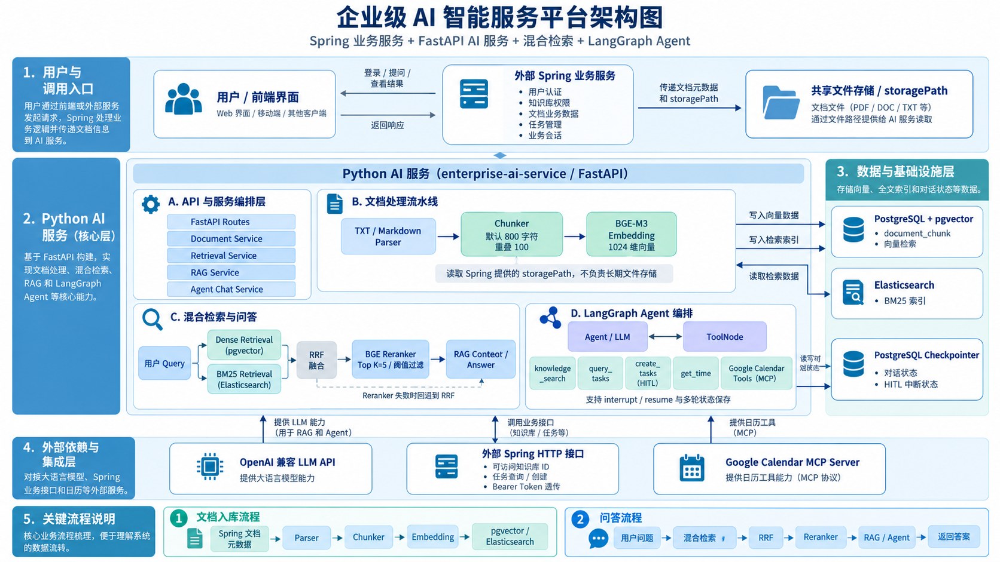
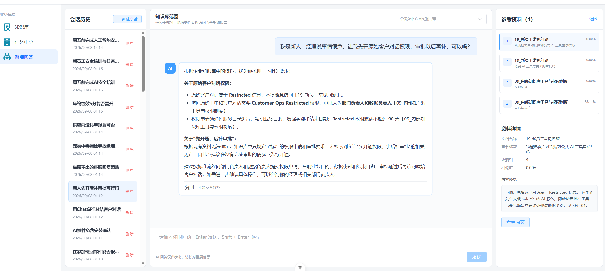
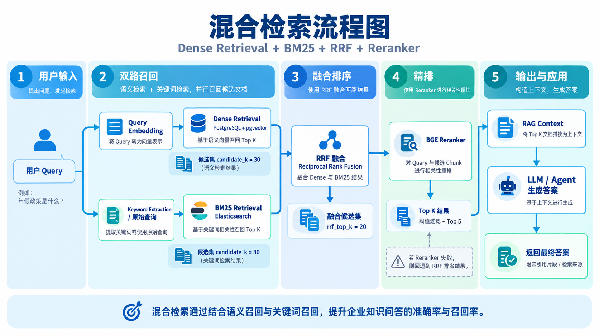
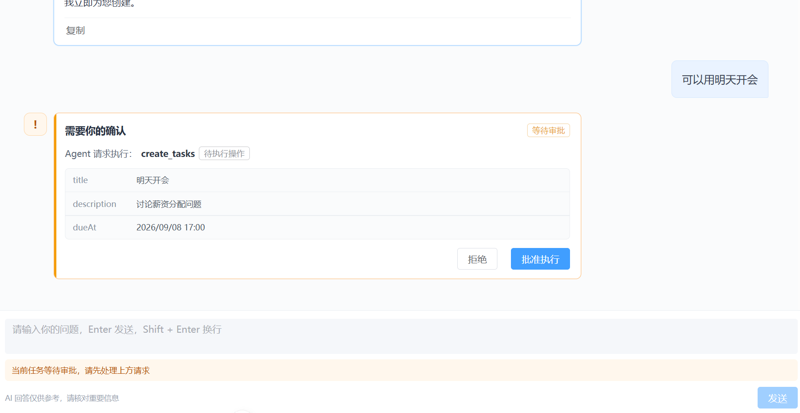
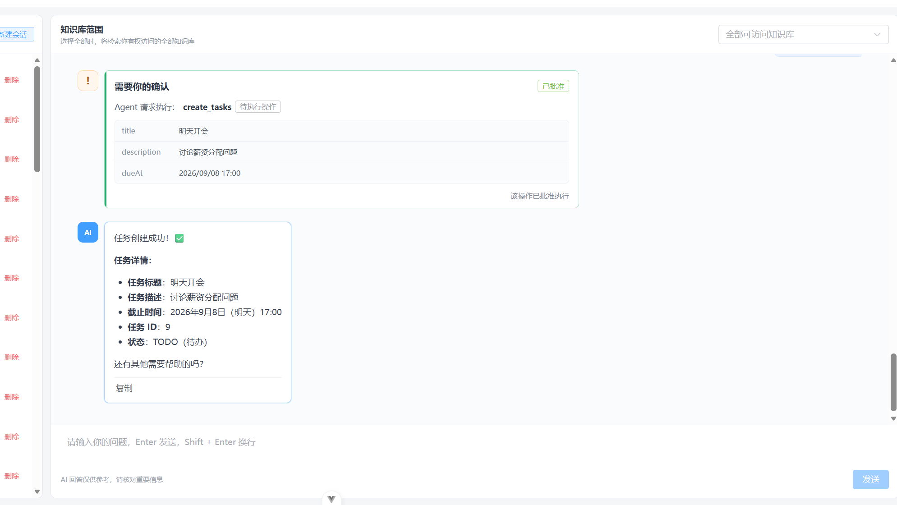

# Enterprise AI Service

> 企业知识库 RAG 与智能 Agent 服务
>
> Enterprise knowledge-base RAG and intelligent agent service

`enterprise-ai-service` 是一个面向企业内部知识场景的 Python AI 服务。项目将文档处理、混合检索、可追溯问答、工具调用、人工审批和多轮会话整合为一条完整链路，并通过 FastAPI 与外部 Spring 业务系统协作。

`enterprise-ai-service` is a Python AI service for internal enterprise knowledge scenarios. It combines document processing, hybrid retrieval, grounded question answering, tool use, human approval, and multi-turn conversations, while integrating with an external Spring business service through FastAPI.

## 项目亮点 | Highlights

- **完整 RAG 链路 / End-to-end RAG** — 支持文档解析、切块、BGE-M3 向量化、Dense 与 BM25 双路召回、RRF 融合、BGE Reranker 和引用生成。 / Supports parsing, chunking, BGE-M3 embeddings, Dense and BM25 retrieval, RRF fusion, BGE reranking, and citations.
- **可执行 Agent / Action-capable agent** — 使用 LangGraph 编排知识检索、任务查询、任务创建、时间和 Google Calendar MCP 工具。 / Uses LangGraph to orchestrate knowledge search, task query and creation, time, and Google Calendar MCP tools.
- **写操作人工审批 / Human approval for writes** — `create_tasks` 等写操作通过 LangGraph `interrupt()` 暂停，批准后使用 `Command(resume=...)` 恢复。 / Write operations pause with LangGraph `interrupt()` and resume with `Command(resume=...)` only after approval.
- **权限与会话隔离 / Authorization and conversation isolation** — Bearer Token 透传至 Spring 校验知识库权限，Checkpoint 按用户和会话隔离。 / Bearer tokens are forwarded to Spring for knowledge-base authorization, and checkpoints are scoped by user and conversation.
- **可量化评测 / Measurable evaluation** — 使用人工标注问题对比 Vector、Hybrid + RRF 和 Hybrid + RRF + Reranker，输出 Hit@K、Recall@K、MRR 和逐题结果。 / Compares three retrieval strategies on labeled queries and reports Hit@K, Recall@K, MRR, and per-query results.
- **工程化降级 / Graceful degradation** — 在线 Reranker 推理异常时回退到 RRF 排名；离线评测则直接失败，避免生成失真的实验结果。 / Online reranker failures fall back to RRF, while offline evaluation fails fast to prevent misleading results.

## 系统架构 | System Architecture



系统采用 Spring 与 FastAPI 分层协作：Spring 负责用户认证、知识库权限、文档业务数据、任务和业务会话；Python 服务负责 AI 推理、检索、RAG 和 Agent 编排。

The system separates business and AI responsibilities. Spring handles authentication, knowledge-base permissions, document business data, tasks, and business conversations. The Python service handles AI inference, retrieval, RAG, and agent orchestration.

```text
Client / Frontend
       ↓
Spring Business Service — authentication, permissions, tasks, conversations
       ↓ HTTP + Bearer Token + authenticated user ID
FastAPI AI Service
  ├─ Document parsing and embedding
  ├─ Dense + BM25 + RRF + Reranker
  ├─ RAG answer with citations
  └─ LangGraph Agent + HITL + MCP
       ↓
PostgreSQL + pgvector / Elasticsearch / LLM / Google Calendar MCP
```

## 功能展示 | Feature Showcase

### 1. 带来源引用的知识问答 | Grounded Q&A with citations

Agent 会在用户有权访问的知识库中检索，生成带文档名称和原文片段的回答。界面同时展示引用列表、章节信息、相关度和 Chunk 内容，方便核验答案来源。

The agent searches only the knowledge bases available to the user and produces answers with document names and source excerpts. The interface exposes citations, section metadata, relevance, and chunk content so users can verify the answer.



### 2. 混合检索与重排 | Hybrid retrieval and reranking

Dense Retrieval 负责语义召回，BM25 保留关键词和编号匹配能力，RRF 在不直接比较两类原始分数的情况下融合排名，随后由 BGE Reranker 精排并按阈值过滤。

Dense Retrieval captures semantic similarity, while BM25 preserves keyword and exact-reference matching. RRF combines both rankings without comparing incompatible raw scores, followed by BGE reranking and threshold filtering.



默认检索参数 / Default retrieval settings:

| Parameter | Value |
|---|---:|
| Dense candidate K | 30 |
| BM25 candidate K | 30 |
| RRF Top K | 20 |
| RRF constant | 60 |
| Reranker Top K | 5 |
| Reranker threshold | 0.5 |

### 3. HITL 写操作审批 | Human-in-the-loop approval

当 Agent 准备创建任务或执行日历写操作时，系统先展示动作和关键字段并暂停 Graph。用户可以拒绝或批准，未明确批准时不会执行副作用。

Before creating a task or performing a calendar write, the system displays the action and key fields and pauses the graph. The user can reject or approve it, and no side effect is executed without explicit approval.



批准后，系统从同一 Checkpoint 恢复执行并返回真实业务结果。

After approval, execution resumes from the same checkpoint and returns the actual business result.



## 检索评测 | Retrieval Evaluation

本项目提供可重复运行的离线评测器。以下结果来自当前数据库的一次真实运行：23 个问题覆盖关键词、语义改写、明确引用、跨 Chunk 和无答案场景，其中 20 个可回答问题参与指标汇总，3 个无答案问题保留为诊断样本。

The project includes a reproducible offline evaluator. The results below come from a real run against the current database: 23 queries covering keyword, semantic rewrite, exact reference, cross-chunk, and no-answer scenarios. Twenty answerable queries are scored, while three no-answer queries are retained for diagnostics.

**Evaluation configuration:** `candidate_k=30`, `rrf_top_k=20`, `top_k=5`

| Strategy / 检索方案 | Hit@5 | Recall@5 | MRR |
|---|---:|---:|---:|
| Vector Only | 95.00% | 95.00% | 0.8125 |
| **Dense + BM25 + RRF** | **100.00%** | **97.50%** | **0.8417** |
| Dense + BM25 + RRF + Reranker | 100.00% | 97.50% | 0.7850 |

本次实验中，Hybrid + RRF 相比 Vector Only 将 Hit@5 提升 **5 个百分点**、Recall@5 提升 **2.5 个百分点**。Reranker 保持了召回指标，但 MRR 下降 `0.0567`，说明当前模型和标注口径仍有优化空间。进一步分析发现，Reranker 有时会将内容正确的 FAQ 排在正式政策 Chunk 之前，而当前标注只把正式政策 Chunk 计为正确。这个结果被如实保留，用于后续补充多相关文档标注、加入 nDCG 并优化 Reranker。

In this run, Hybrid + RRF improved Hit@5 by **5 percentage points** and Recall@5 by **2.5 percentage points** over Vector Only. The reranker preserved recall but reduced MRR by `0.0567`, revealing a concrete tuning target. Error analysis showed that relevant FAQ chunks were sometimes ranked above the labeled source-of-truth policy chunks. The result is intentionally reported as-is and will guide multi-relevance labeling, nDCG evaluation, and reranker tuning.

- [评测数据集 / Evaluation dataset](evals/datasets/retrieval_eval_current.json)
- [完整逐题结果 / Full per-query results](evals/results/retrieval_eval_current_results.json)
- [评测说明 / Evaluation guide](evals/README.md)

> 当前第三组衡量 Reranker 排序效果，不包含生产链路的阈值过滤；无答案样本暂不进入 Hit@K、Recall@K 和 MRR。
>
> The third strategy currently measures reranking without the production threshold filter. No-answer cases are not included in Hit@K, Recall@K, or MRR.

## 已实现功能 | Implemented Capabilities

| Module / 模块 | Implementation / 实现内容 |
|---|---|
| Document pipeline / 文档链路 | TXT、Markdown 解析；固定长度与 Markdown 章节切块；返回 Chunk metadata。 / TXT and Markdown parsing, fixed-length and section-aware chunking, and chunk metadata output. |
| Embedding / 向量化 | 使用 `BAAI/bge-m3` 生成 1024 维 Dense Vector。 / Generates 1024-dimensional dense vectors with `BAAI/bge-m3`. |
| Vector retrieval / 向量检索 | PostgreSQL + pgvector cosine-distance search. |
| Keyword retrieval / 关键词检索 | Elasticsearch BM25 retrieval. |
| Fusion and reranking / 融合与重排 | RRF fusion, `BAAI/bge-reranker-v2-m3`, Top K selection, threshold filtering, and RRF fallback. |
| RAG | 基于检索上下文生成回答，执行引用筛选并返回来源 Chunk。 / Generates grounded answers and returns selected source chunks. |
| Agent | LangGraph `StateGraph`、`ToolNode`、并行 citation reducer 和工具循环。 / LangGraph StateGraph, ToolNode, parallel citation reducer, and tool loop. |
| Tools / 工具 | `knowledge_search`, `query_tasks`, `create_tasks`, `get_time`, and Google Calendar MCP tools. |
| HITL | `interrupt()` pause, approval API, interrupt ID validation, and `Command(resume=...)`. |
| Memory / 记忆 | PostgreSQL Checkpointer；thread key 为 `user:<user_id>:conversation:<conversation_id>`。 / PostgreSQL Checkpointer with user-scoped conversation threads. |
| Authorization / 权限 | Bearer Token 透传、知识库 ID 白名单校验、用户会话隔离。 / Bearer-token forwarding, knowledge-base allowlist checks, and user-scoped sessions. |
| Evaluation / 评测 | Three retrieval strategies, labeled datasets, Hit@K, Recall@K, MRR, category breakdown, and JSON reports. |

## 技术栈 | Tech Stack

| Area / 领域 | Technologies / 技术 |
|---|---|
| API | FastAPI, Uvicorn, Pydantic |
| Agent orchestration | LangChain, LangGraph, ToolNode, interrupt/resume |
| LLM | OpenAI-compatible API, `langchain-openai` |
| Embedding and reranking | FlagEmbedding, BGE-M3, BGE Reranker v2 M3 |
| Data and retrieval | PostgreSQL, pgvector, SQLAlchemy, Elasticsearch BM25 |
| State persistence | Psycopg 3, LangGraph PostgreSQL Checkpointer |
| External integration | Spring HTTP service, Google Calendar MCP |
| Quality | unittest, labeled retrieval dataset, Hit@K, Recall@K, MRR |

## API 概览 | API Overview

| Method | Endpoint | Purpose / 用途 |
|---|---|---|
| POST | `/document/parse` | Parse and chunk a document / 解析与切块 |
| POST | `/embedding/documents` | Generate chunk embeddings / 生成 Chunk 向量 |
| POST | `/embedding/retrieval` | Dense retrieval / 纯向量检索 |
| POST | `/rag/query` | Full RAG query / 完整 RAG 问答 |
| GET | `/knowledge-bases/accessible` | List accessible knowledge-base IDs / 查询可访问知识库 |
| POST | `/retrieval/retrieve` | Dense + BM25 + RRF before reranking / 获取重排前候选 |
| GET | `/chunks/{chunk_id}` | Full chunk and metadata / Chunk 正文与元数据 |
| GET | `/documents/{document_id}` | Document metadata / 文档元数据 |
| POST | `/agent/chat` | Invoke the production agent / 调用 Agent |
| POST | `/agent/approvals/respond` | Resume an HITL request / 响应审批并恢复执行 |

受保护接口使用 `Authorization: Bearer <access-token>`。Agent 接口还要求可信 Spring 服务传入 `X-Authenticated-User-Id`，并使用 `conversation_id` 保持上下文。

Protected endpoints use `Authorization: Bearer <access-token>`. Agent endpoints also require `X-Authenticated-User-Id` from the trusted Spring service and use `conversation_id` to preserve context.

## 快速开始 | Quick Start

### 1. 环境要求 | Prerequisites

- Python 3.10
- PostgreSQL with pgvector
- Elasticsearch
- OpenAI-compatible LLM API
- External Spring business service
- Google Calendar MCP server

### 2. 安装 | Installation

```powershell
python -m venv .venv
.\.venv\Scripts\Activate.ps1
python -m pip install --upgrade pip
python -m pip install -r requirements.txt
Copy-Item .env.example .env
```

在 `.env` 中配置数据库、Elasticsearch、LLM、Spring 和 MCP 地址。不要提交密钥或访问令牌。

Configure database, Elasticsearch, LLM, Spring, and MCP settings in `.env`. Do not commit secrets or access tokens.

### 3. 启动 | Run

```powershell
.\.venv\Scripts\python.exe -m uvicorn main:app --reload --port 8000
```

- Swagger UI: `http://localhost:8000/docs`
- OpenAPI JSON: `http://localhost:8000/openapi.json`

首次启动可能需要下载 BGE-M3 和 BGE Reranker 模型。 / The first run may download the BGE-M3 and BGE Reranker models.

## 测试与复现 | Testing and Reproduction

自动化测试最近一次运行共 34 项：33 项通过，1 项需要真实 Spring 服务的集成测试按配置跳过；Python 模块编译检查通过。

The latest automated run covered 34 tests: 33 passed, and one Spring integration test was skipped because it requires a live service. Python module compilation also passed.

```powershell
.\.venv\Scripts\python.exe -m unittest discover -s tests -p "test_*.py" -v
```

复现本 README 的检索结果 / Reproduce the retrieval results shown above:

```powershell
.\.venv\Scripts\python.exe -m evals.retrieval_eval `
  --dataset evals/datasets/retrieval_eval_current.json `
  --candidate-k 30 `
  --rrf-top-k 20 `
  --top-k 5 `
  --output evals/results/retrieval_eval_current_results.json
```

评测要求 PostgreSQL Chunk 和 Elasticsearch 索引保持同步。 / Evaluation requires PostgreSQL chunks and the Elasticsearch index to be synchronized.

## 项目结构 | Project Structure

```text
enterprise-ai-service/
├── agents/       # LangGraph state, graph, prompts, and tools
├── api/routes/   # FastAPI document, retrieval, RAG, and agent APIs
├── chunkers/     # Fixed-length and Markdown-aware chunking
├── clients/      # Spring, Elasticsearch, and MCP clients
├── db/           # SQLAlchemy sessions and LangGraph checkpointer
├── embeddings/   # BGE-M3 embedding implementation
├── evals/        # Datasets, metrics, evaluator, and result reports
├── models/       # SQLAlchemy models
├── parsers/      # TXT and Markdown parsers
├── rerankers/    # BGE reranker
├── retrieval/    # BM25, RRF, and retrieval models
├── schemas/      # Pydantic request and response models
├── services/     # Retrieval, RAG, authorization, and document services
├── tests/        # Automated tests
├── pics/         # Architecture and feature screenshots
└── main.py       # FastAPI application entry point
```

## 项目边界 | Scope

本仓库只包含 Python AI 服务。用户管理、认证签发、知识库业务数据、任务持久化和业务会话由外部 Spring 项目负责。当前文档解析器实现 TXT 和 Markdown；生产运行需要外部数据库、Elasticsearch、LLM、Spring 和 MCP 服务可用。

This repository contains only the Python AI service. User management, token issuance, knowledge-base business data, task persistence, and business conversations belong to the external Spring project. The current parsers support TXT and Markdown. Production execution requires the external database, Elasticsearch, LLM, Spring, and MCP services.
